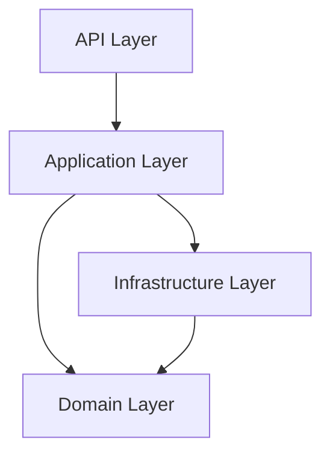

# Quản lý Cửa hàng Sách (Bookstore Inventory)

## 📝 Giới thiệu
Ứng dụng web API quản lý cửa hàng sách, phát triển bằng ASP.NET Core, hỗ trợ quản lý thông tin sách và kho hàng hiệu quả.

## 🚀 Công nghệ
- ASP.NET Core (.NET 8.0, .NET 9.0)
- C# 12.0, C# 13.0
- Entity Framework Core
- SQL Server
- Docker
- Swagger/OpenAPI
- JWT Authentication

## 🏗️ Kiến trúc
Clean Architecture với 4 layer:


## ✨ Tính năng
- 📚 **Quản lý Sách**
    - CRUD operations
    - Tìm kiếm nâng cao
    - Xem chi tiết
    - Import/Export danh sách

- 📑 **Quản lý Danh mục**
    - Thêm/sửa/xóa danh mục
    - Phân cấp danh mục
    - Gán sách vào danh mục

- 📦 **Quản lý Kho**
    - Theo dõi tồn kho
    - Nhập/xuất kho
    - Lịch sử nhập xuất

- 👥 **Quản lý User**
    - Authentication
    - Authorization
    - Profile management
    - Phân quyền chi tiết

## ⚙️ Cài đặt

### Yêu cầu
- .NET SDK 8.0+
- SQL Server
- Docker (optional)

### Local Setup
```bash
# Clone repo
git clone [url]

# Restore 
dotnet restore

# Update DB
dotnet ef database update

# Run
dotnet run
```

### Docker
```bash
docker build -t bookstore-api .
docker run -p 8080:80 bookstore-api
```

## 🔧 Cấu hình
```json
{
  "ConnectionStrings": {
    "DefaultConnection": "Server=...;"
  },
  "JwtSettings": {
    "SecretKey": "your-secret-key",
    "Issuer": "your-issuer",
    "Audience": "your-audience"
  },
  "CategorySettings": {
    "MaxLevel": 3,
    "AllowMultipleParents": false
  }
}
```

## 📚 API Documentation
- Swagger UI: `http://localhost:8080/swagger`
- Endpoints:
    - Books:
        - `GET /api/books` - Lấy danh sách sách
        - `POST /api/books` - Thêm sách mới
        - `PUT /api/books/{id}` - Cập nhật sách
        - `DELETE /api/books/{id}` - Xóa sách

    - Categories:
        - `GET /api/categories` - Lấy danh sách danh mục
        - `GET /api/categories/{id}/books` - Lấy sách theo danh mục
        - `POST /api/categories` - Thêm danh mục mới
        - `PUT /api/categories/{id}` - Cập nhật danh mục
        - `DELETE /api/categories/{id}` - Xóa danh mục
        - `POST /api/categories/{id}/books` - Thêm sách vào danh mục

## 🎯 Design Patterns
- Repository Pattern
- Unit of Work
- Dependency Injection
- CQRS
- Mediator
- DTO
- Factory
- Singleton

## 🧪 Testing
- Unit Tests
- Integration Tests
- API Tests
- E2E Tests

## 🔄 CI/CD
- GitHub Actions
- Docker Hub
- Render Deployment

## 🤝 Đóng góp
1. Fork repo
2. Tạo nhánh feature
3. Commit thay đổi
4. Push
5. Tạo Pull Request

## ❗ Xử lý lỗi thường gặp
1. **Database Connection**
    - Check connection string
    - SQL Server status

2. **Authentication**
    - JWT config
    - Token validation

3. **Category Management**
    - Kiểm tra quan hệ cha-con
    - Xử lý xung đột khi xóa
    - Giới hạn độ sâu danh mục

## 👤 Tác giả
- Ngoc Huynh

## 📄 License
MIT License

## 📞 Liên hệ
- 📧 Email: [email]
- 🔗 GitHub: [profile]

## 📝 Changelog

### v1.0.0 (2024-03-xx)
- Initial release
- Basic CRUD
- JWT auth
- Category management

### v1.1.0 (Upcoming)
- Reports
- Performance optimization
- Additional tests
- Category import/export
- Bulk operations

## ⚠️ Lưu ý
- Backup data trước khi update
- Check .NET compatibility
- Follow coding standards
- Kiểm tra ràng buộc danh mục trước khi xóa
- Đảm bảo tính nhất quán của dữ liệu

---
*Cập nhật: Tháng 4/2024*